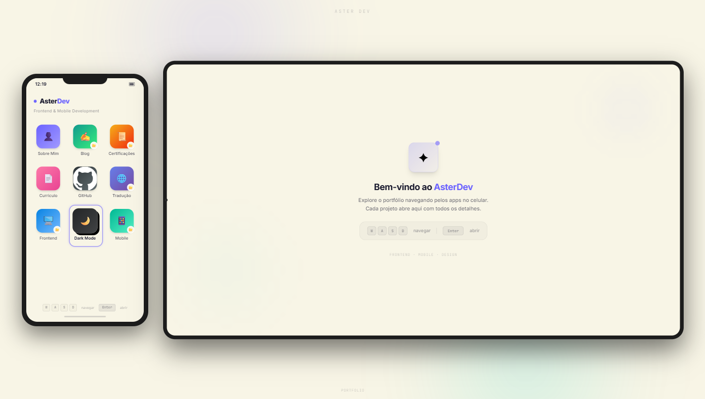
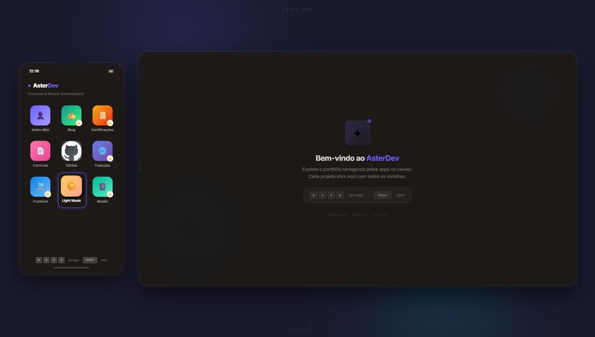
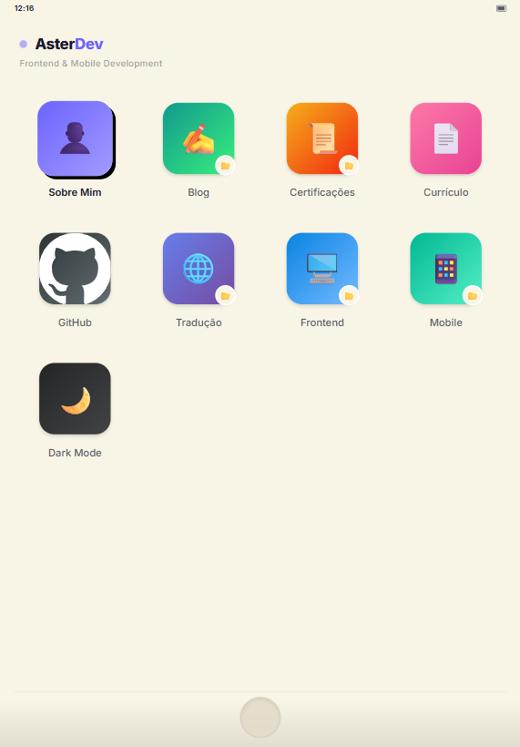
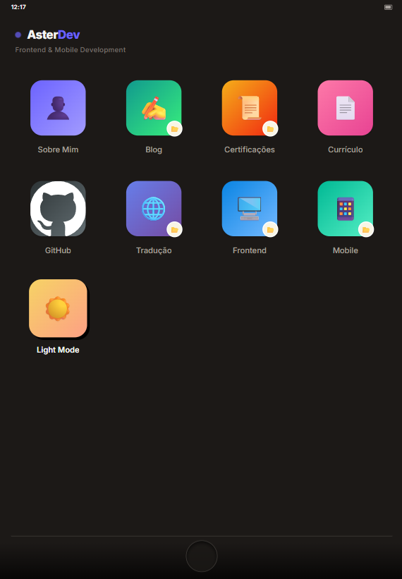
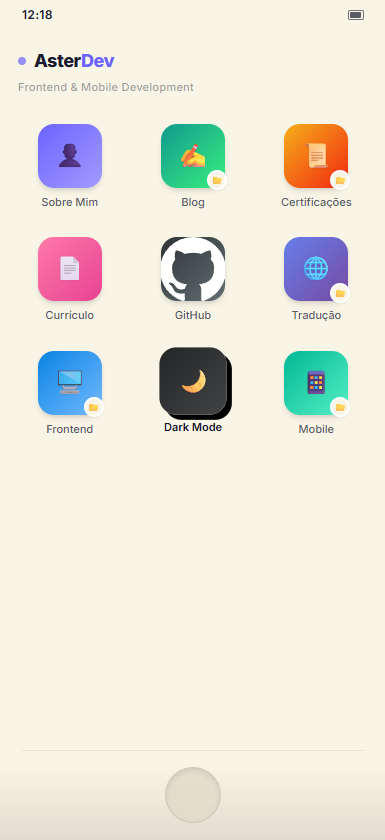
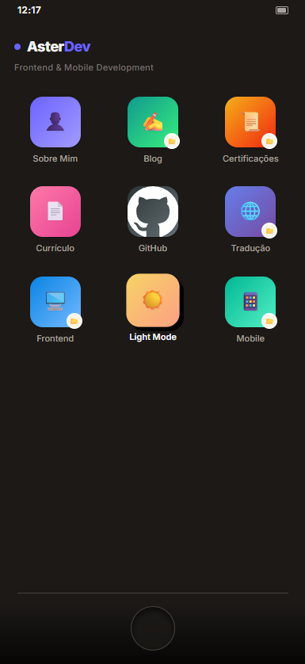

# ✦ Aster Dev

> **Frontend & Mobile Development Portfolio**  
> Experiência inspirada no ecossistema iOS/iPadOS com navegação fluida e UX minimalista.

---

## 📸 Preview

### Desktop (Light & Dark Mode)
<div align="center">
  
  
</div>

### Tablet (Light & Dark Mode)
<div align="center">
  
  
</div>

### Mobile (Light & Dark Mode)
<div align="center">
  
  
</div>

---

## 🎯 Sobre o Projeto

**Aster Dev** é um portfólio técnico focado em demonstrar expertise em desenvolvimento frontend e mobile através de uma interface que replica a experiência do iOS/iPadOS.

O projeto não é apenas um showcase visual — é uma demonstração prática de soluções técnicas avançadas para problemas reais de responsividade, acessibilidade e internacionalização.

---

## ⚡ Diferenciais Técnicos

### 🔧 Responsividade Avançada
- **Container Queries**: Uso de `@tailwindcss/container-queries` para layouts que se adaptam ao tamanho do container, não apenas da viewport
- **Alturas Dinâmicas**: Implementação de `100dvh` (dynamic viewport height) para garantir que o layout nunca quebre, independentemente da barra de navegação do browser
- **Grid Adaptativo**: Sistema de grid que transforma de 3 colunas (mobile) para 4 colunas (tablet) com reordenamento visual automático via CSS `order`

### ♿ Acessibilidade
- **Navegação por Teclado Customizada**: Sistema completo de navegação usando WASD e setas direcionais
- **Sincronização Visual**: Lógica de foco totalmente sincronizada com a estrutura visual do grid
- **ARIA Labels**: Implementação completa de atributos semânticos para leitores de tela

### 🌐 Internacionalização (i18n)
- **Arquitetura Escalável**: Suporte para **15+ idiomas** estruturado via JSON
- **Deep Linking Multi-idioma**: URLs amigáveis com detecção automática de idioma (`/br/`, `/en/`, `/es/`, etc.)
- **Persistência de Preferência**: Sistema de localStorage sincronizado com navegação do browser

### 🎨 Experiência iOS-like
- **Animações Nativas**: Transições suaves inspiradas no iOS com `transform` e `opacity`
- **Lazy Loading Inteligente**: Carregamento de mídia apenas após conclusão das animações de entrada
- **Hardware Acceleration**: Uso estratégico de `translateZ(0)` para isolar camadas e otimizar performance

---

## 🛠️ Stack Técnica

```json
{
  "framework": "React 19.2.5",
  "linguagem": "TypeScript 6.0.2",
  "bundler": "Vite 8.0.10",
  "estilização": "Tailwind CSS 3.4.19",
  "plugins": [
    "@tailwindcss/container-queries",
    "@vitejs/plugin-react"
  ]
}
```

---

## 📂 Arquitetura do Projeto

```
src/
├── data/
│   └── aster.ts          # Centralização de dados (projetos, links, tipos)
├── locales/
│   ├── br.json           # Português (Brasil)
│   ├── en.json           # English
│   ├── es.json           # Español
│   └── ...               # 15+ idiomas
├── App.tsx               # Componente principal
└── main.tsx              # Entry point
```

### Princípios Arquiteturais

- **Single Source of Truth**: Todos os dados de projetos, links e configurações ficam centralizados em `src/data/aster.ts`
- **Separação de Concerns**: Traduções isoladas em `src/locales/` com carregamento dinâmico
- **Type Safety**: Sistema de tipos robusto com TypeScript para garantir consistência entre idiomas e dados

---

## 🚀 Como Rodar Localmente

### Pré-requisitos
- Node.js 18+ 
- npm ou yarn

### Instalação

```bash
# Clone o repositório
git clone https://github.com/zAstergun/asterdev.me.git

# Entre no diretório
cd asterdev.me

# Instale as dependências
npm install

# Inicie o servidor de desenvolvimento
npm run dev
```

O projeto estará disponível em `http://localhost:5173`

### Build para Produção

```bash
# Gera build otimizado
npm run build

# Preview do build
npm run preview
```

---

## 🎮 Funcionalidades

- ✅ **Grid Interativo**: Navegação fluida entre projetos e pastas
- ✅ **Detail Panel**: Visualização detalhada de projetos com animações iOS-like
- ✅ **Dark Mode**: Alternância suave entre temas claro e escuro
- ✅ **Deep Linking**: URLs diretas para projetos específicos (`?app=project-id`)
- ✅ **Keyboard Navigation**: Controle total via teclado (WASD + Enter)
- ✅ **Responsive Design**: Experiência otimizada para mobile, tablet e desktop
- ✅ **Multi-idioma**: Suporte para 15+ idiomas com detecção automática

---

## 📝 Licença / License

**Português:**
Este projeto é de propriedade exclusiva de **Aster Dev**. Todos os direitos reservados. Não é permitida a cópia, distribuição ou uso não autorizado de qualquer parte deste código ou design sem autorização prévia.

**English:**
This project is the exclusive property of **Aster Dev**. All rights reserved. Unauthorized copying, distribution, or use of any part of this code or design without prior permission is strictly prohibited.

---

## 👤 Autor

**Aster Dev**  
Frontend & Mobile Development

- GitHub: [@zAstergun](https://github.com/zAstergun)
- Email: hello@asterdev.me

---

<div align="center">
  <sub>Construído com ❤️ e TypeScript</sub>
</div>
